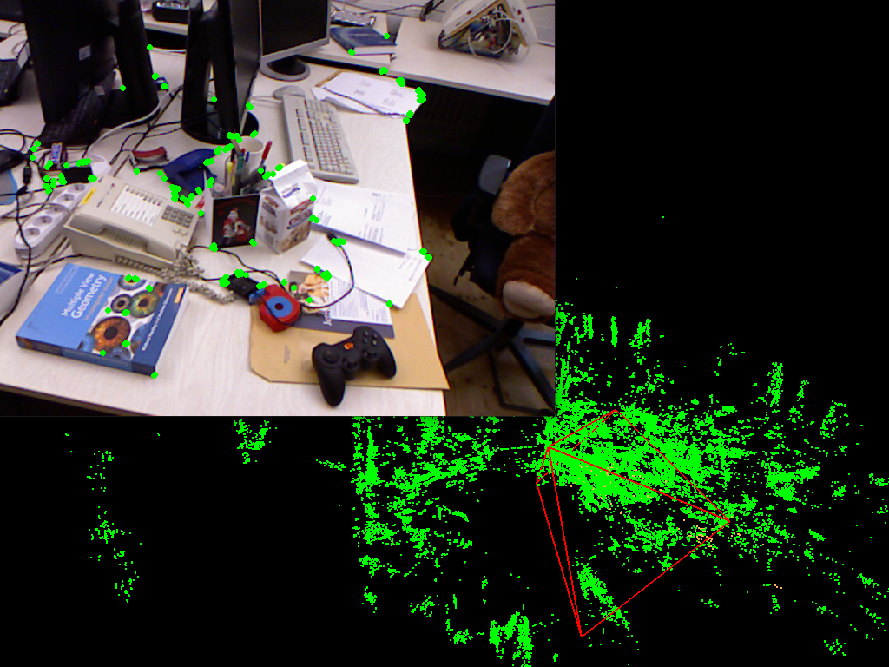
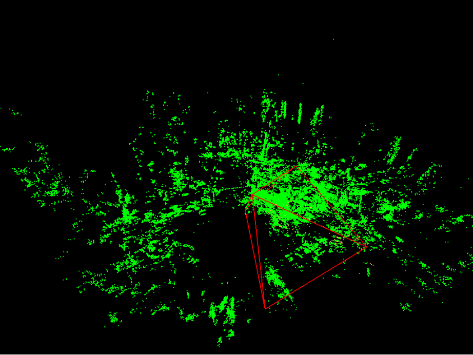
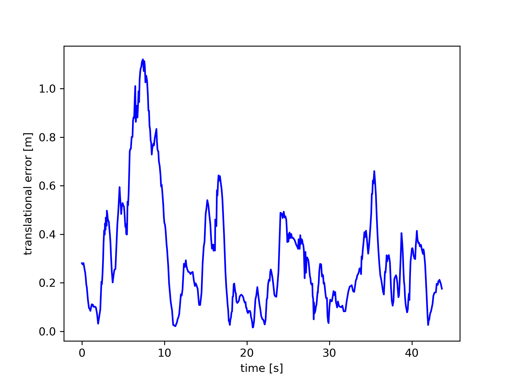
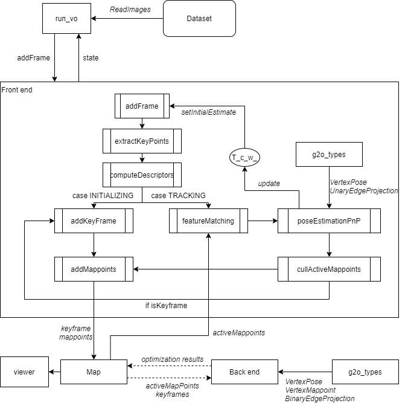

# RGBD_VisualOdometry

This repo is modified from gaoxiang12's [slambook/project/0.4](https://github.com/gaoxiang12/slambook/tree/master/project/0.4). This repo is a VO (Visual Odometry) for RGBD video stream. 

It could track the camera's poses and the mappoints in space and render them as a point cloud map. 

The first image shows the frame with the features drew on, and the second image shows the generated point cloud.

<p float="left">
  
  
</p>

## Requirements

* Ubuntu: 18.04
* CMake
* Opencv: 3.1
* Eigen3
* Sophus: commit [13fb328](https://github.com/strasdat/Sophus/tree/13fb3288311485dc94e3226b69c9b59cd06ff94e)
* G2O: commit [9b41a4e](https://github.com/RainerKuemmerle/g2o/tree/9b41a4ea5ade8e1250b9c1b279f3a9c098811b5a)
* Pangolin: commit [1ec721d](https://github.com/stevenlovegrove/Pangolin/tree/1ec721d59ff6b799b9c24b8817f3b7ad2c929b83)

You could refers to the `docker/dockerfile` for commands of how to install the dependencies.

**Note**. the dockerfile contains a `display_x11.patch` file for Pangolin package, it is mainly for the docker usage because docker requires X11 to run the GUI application. If you don't develope in the docker, you don't need to apply this patch.


## Build repo

Clone and build this repo with CMake

```
git clone https://github.com/BerwinZ/RGBD_VisualOdometry.git
cd RGBD_VisualOdometry
mkdir build
cd build
cmake ..
make
```

This will build the library file into `<repo_path>/lib/libmyslam.so`, and a sample VO executable in `<repo_path>/bin/run_vo`. 

## Run sample application

### Prepare dataset

This repo uses [TUM dataset](https://vision.in.tum.de/data/datasets/rgbd-dataset/download) to test. Download one of the dataset from the website. e.g.

```
cd <your_dataset_folder>
wget https://vision.in.tum.de/rgbd/dataset/freiburg1/rgbd_dataset_freiburg1_xyz.tgz
tar zxvf rgbd_dataset_freiburg1_xyz.tgz
```

In order to process the dataset, following packages should be installed. 

* Python3
  * Numpy module with `pip3 install numpy`
  * Matplotlib module with `pip3 install matplotlib`

In order to generate a file to align the RGB images and the depth images for VO to use, you need to modify the paths in the `tools/run_associate.sh` file, and run it with `sh run_associate.sh`. This will generate the `associate.txt` file in the dataset folder.

Then modify the `dataset_dir` setting in `config/default.yml` to the generated `associate.txt` file.

### Run sample VO

```
cd <repo_path>
mkdir output
bin/run_vo config/default.yml
```

### Evaluation

The TUM dataset also provides the tools to evaluate the estimated trajectory. Those scripts are also placed in the `tools` folder. 

The `run_vo` app will save the estiamted trajectory to a `.txt` file. Then you can use the scripts to compute ATE (accumulated trajectory error) or RPE (relative pose error) based on the output file and `groundtruth.txt` provided by dataset. 

You can also generate the trajectory in plane or the drift error per second. This requires Python3 with matplotlib module installed. 

<p float="left">
  
  
</p>

## Use repo with Docker

If you plan to use docker to develop, follows the following steps

1. Pull the built image from [here](https://hub.docker.com/repository/docker/zbw1455/myslam)
```
docker pull zbw1455/myslam:rgbd_vo
```
2. Configure the docker to support GUI application by this [link](https://cuneyt.aliustaoglu.biz/en/running-gui-applications-in-docker-on-windows-linux-mac-hosts/)
3. Download the dataset
4. Check your machine's IP
5. Run the docker container by
```
docker run -it --rm \
            -v /path-to-dataset-in-disk/:/path-of-dataset-in-docker/ \
            -e DISPLAY=YOUR-IP:0.0 \
            zbw1455/myslam:rgbd_vo
```

or

You can manually build this image by
```
docker -t myslam /path-to-this-repo/docker/
```

**Note**. For docker development, only running in Windows with `VcXsrv Windows X Server` to support the GUI is tested. There might be driver issues for other platforms. If this happens, you could refers to this [link](https://gernotklingler.com/blog/howto-get-hardware-accelerated-opengl-support-docker/).

## Explanation of VO work flow

This repos is only a VO. It uses the following techniques. 

* Use `ORB` feature to extract features, descriptors
* Establish a map to store active mappoints and do the feature matching with new coming frame
    * Remove mappoints points and add new space points to control the scale of the map
* Use 3D-2D to calculate the pose
    * Use `EPNP` to calculate the initial value of frame's pose
    * Use BA to estimate the final pose of the frame
* Local backend
    * If backend provided, use the local backend to optimize the position of active mappoints and the poses of frames
    * If backend not provided, use the triangulation to optimize the position of active mappoints

The workflow is as the following image. 


