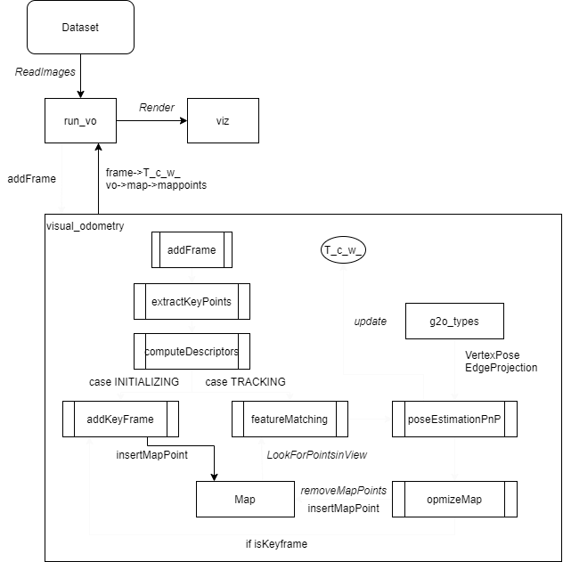

# RGBD_VisualOdometry

This repo is modified from gaoxiang12's [slambook/project/0.4](https://github.com/gaoxiang12/slambook/tree/master/project/0.4). This repo is a VO (Visual Odometry) for RGBD stream. It could track the camera's poses and the keypoints in space and render them with viz. 

## Requirements

* C++ 11
* CMake
* Opencv: 3.1 with viz module
* Eigen3
* Sophus: commit [13fb328](https://github.com/strasdat/Sophus/tree/13fb3288311485dc94e3226b69c9b59cd06ff94e)
* G2O: commit [9b41a4e](https://github.com/RainerKuemmerle/g2o/tree/9b41a4ea5ade8e1250b9c1b279f3a9c098811b5a)

## Dataset

[TUM dataset](https://vision.in.tum.de/data/datasets/rgbd-dataset/download)

## Work Flow

This repos is only a VO. It uses the following techniques. 

* Use `ORB` feature to extract features, descriptors
* Establish a local map to store space key-points and do the feature matching with new coming frame
* Use 3D-2D to calculate the pose
    * Use `EPNP` to calculate the initial value of frame's pose
    * Use BA to estimate the final pose of the frame

The workflow is as the following image. 

